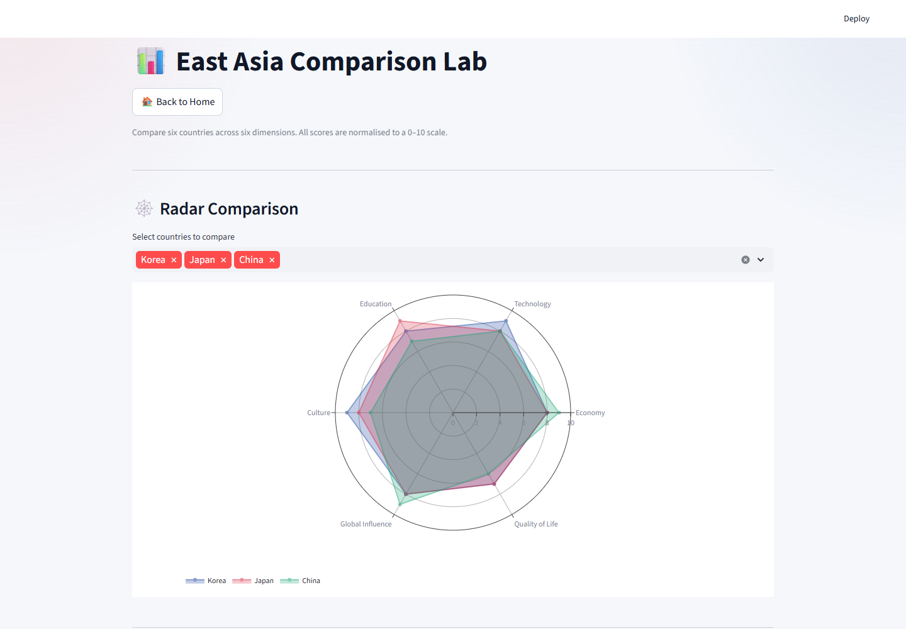
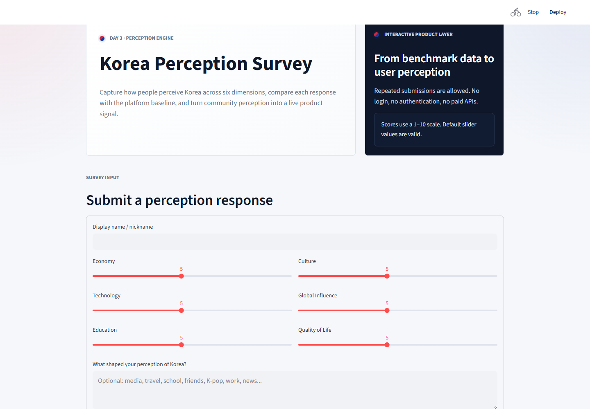
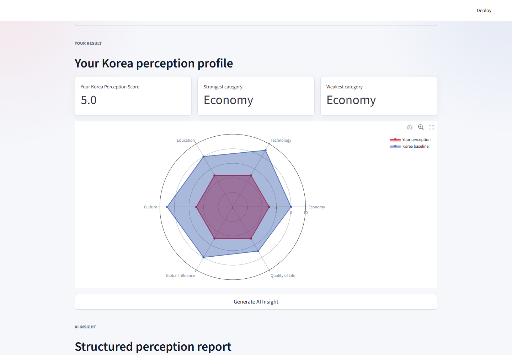
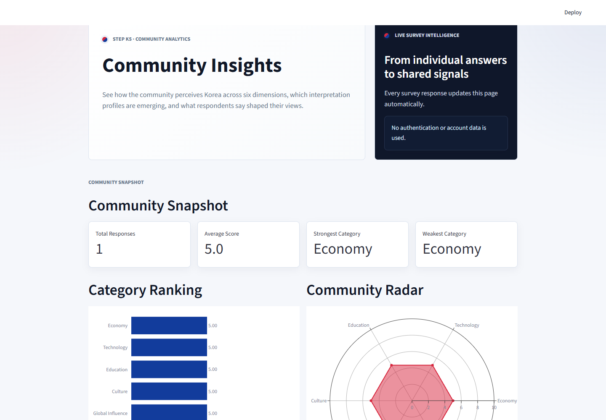
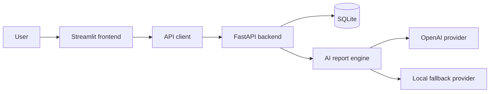

# Korea Analysis

> Understanding Korea Through Data

Korea Analysis is an interactive data product for exploring how Korea is measured and perceived. It combines regional benchmarking, a public perception survey, structured AI reports, and aggregated community insights in one Streamlit and FastAPI application.

## Screenshots

### Home


### Comparison Lab



### Perception Survey



### AI Perception Report



### Community Insights



## Features

### Compare

- Benchmark Korea against Japan, China, Singapore, Vietnam, and Thailand.
- Explore Economy, Technology, Education, Culture, Global Influence, and Quality of Life.
- Use radar charts, category rankings, and filterable data tables.

### Perceive

- Submit a six-dimension Korea perception survey.
- Compare individual scores with the Korea platform baseline.
- Store repeated anonymous or nickname-based submissions.

### Analyze

- Generate structured perception reports from survey results.
- Use `gpt-4o-mini` when an OpenAI API key is available.
- Fall back automatically to a deterministic local report provider.

### Understand

- View community category averages and rankings.
- Explore interpretation profile distribution.
- Read recent respondent comments without account data.

## Architecture



Detailed architecture and request flows are documented in [docs/architecture.md](docs/architecture.md).

## Tech Stack

| Layer | Technology |
|---|---|
| Frontend | Streamlit |
| Visualizations | Plotly |
| Backend | FastAPI |
| Validation | Pydantic |
| ORM | SQLAlchemy |
| Database | SQLite |
| HTTP client | Requests |
| AI provider | OpenAI-compatible SDK |
| Local AI fallback | Rule-based structured report engine |
| Tests | Pytest and FastAPI TestClient |

## Portfolio Highlights

- FastAPI REST API with modular routers
- Streamlit multi-page product interface
- Plotly radar, bar, and profile distribution visualizations
- Validated perception survey workflow
- Structured AI-generated reports
- OpenAI provider with automatic local fallback
- Community analytics and comment aggregation
- SQLite persistence with SQLAlchemy
- Automated endpoint and business-rule testing

## Project Structure

```text
south_korea_perception_analysis/
|-- app.py
|-- api_client.py
|-- ui_style.py
|-- requirements.txt
|-- pages/
|   |-- 1_Comparison_Lab.py
|   |-- 2_Perception_Survey.py
|   `-- 3_Community_Insights.py
|-- backend/
|   |-- requirements.txt
|   `-- app/
|       |-- main.py
|       |-- config.py
|       |-- database.py
|       |-- models.py
|       |-- schemas.py
|       |-- ai/
|       |   |-- report_engine.py
|       |   |-- openai_provider.py
|       |   `-- local_provider.py
|       `-- routers/
|           |-- health.py
|           |-- countries.py
|           |-- surveys.py
|           `-- ai.py
|-- tests/
|   |-- test_surveys.py
|   |-- test_ai_report.py
|   `-- test_community_summary.py
|-- docs/
|   |-- architecture.md
|   `-- screenshots/
`-- CHANGELOG.md
```

## Local Setup

### 1. Clone and enter the project

```bash
git clone <repository-url>
cd south_korea_perception_analysis
```

### 2. Install backend dependencies

```bash
cd backend
pip install -r requirements.txt
```

### 3. Start the API

```bash
uvicorn app.main:app --reload
```

The API is available at `http://localhost:8000` and the interactive documentation at `http://localhost:8000/docs`.

### 4. Start the frontend

In a second terminal:

```bash
cd south_korea_perception_analysis
pip install -r requirements.txt
streamlit run app.py
```

The frontend is available at `http://localhost:8501`.

### Optional OpenAI configuration

The product works without a paid API.

```powershell
$env:OPENAI_API_KEY="your-key"
```

When the key is missing or the provider fails, Korea Analysis automatically uses the local structured-report provider.

## API Overview

| Method | Endpoint | Purpose |
|---|---|---|
| `GET` | `/api/v1/health` | Service health |
| `GET` | `/api/v1/countries` | Country benchmark scores |
| `GET` | `/api/v1/countries/{country}` | Scores for one country |
| `POST` | `/api/v1/perception-surveys` | Submit a survey |
| `GET` | `/api/v1/perception-surveys` | Latest survey submissions |
| `GET` | `/api/v1/perception-surveys/stats` | Survey statistics and Korea baseline |
| `GET` | `/api/v1/perception-surveys/community-summary` | Community analytics |
| `POST` | `/api/v1/ai/perception-report` | Structured perception report |

## Testing

```bash
pytest
```

The test suite covers survey validation, survey endpoints, community aggregation, profile classification, local AI fallback, and AI report responses.

## Roadmap

- Improve responsive mobile layouts
- Add exportable PDF perception reports
- Add configurable benchmark datasets and data provenance
- Add deployment configuration and automated CI checks
- Add accessibility and internationalization review

## License

This project is licensed under the MIT License.
See the [LICENSE](LICENSE) file for details.
