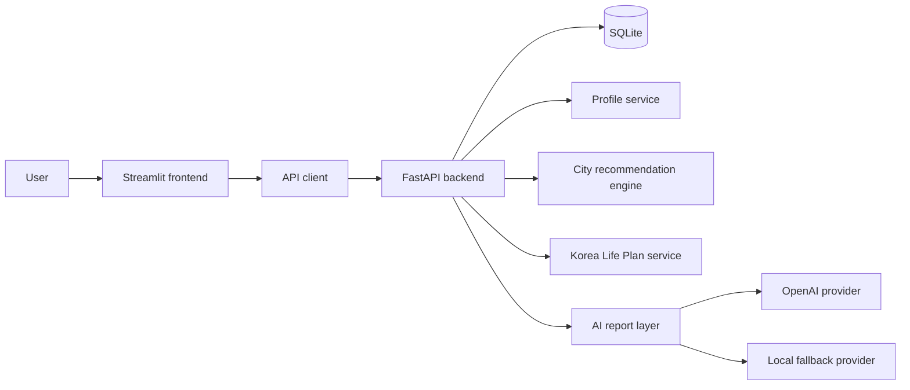
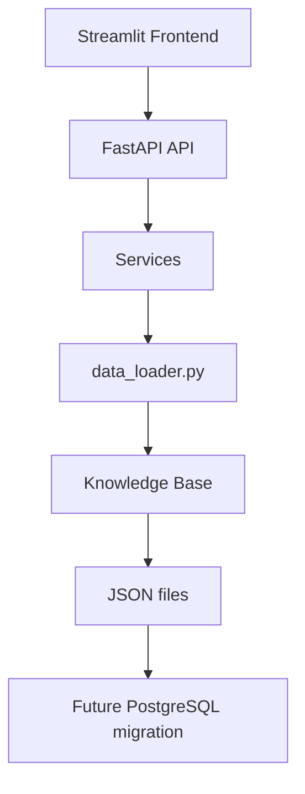

# Korea Compass

> Your AI Guide to Study, Work & Life in South Korea

Korea Compass is a full-stack information and planning app for international students and job seekers who are considering South Korea. It helps users explore Korea, create a reusable profile, estimate study and living costs, analyze career outlook, compare Korean cities, get scene-based Korean language support, track news and visa policy, and generate an exportable AI Korea Life Plan.

Version 1.0 packages the Explore, Study, Work, Live, Korean Learning, AI planning, Knowledge Base, Source Registry, and Official Data Integration Foundation work into a portfolio-ready release.

## Project Docs

* [Release Notes](RELEASE_NOTES.md)
* [Portfolio Summary](PORTFOLIO_SUMMARY.md)
* [Demo Script](DEMO_SCRIPT.md)
* [Deployment Guide](DEPLOYMENT.md)
* [Project Health](PROJECT_HEALTH.md)

## Screenshots

### Home — Korea Compass Workflow


### Explore Korea


### Cities


### Cost of Living


### Korean Learning Support


### Study Cost Calculator


### Career & Job Market Analyzer


### AI Korea Life Plan


### News & Policy


## Features

### Explore Korea

Explore Korea turns the product from a planning-only tool into a broader Korea information platform. It includes:

* Overview: country introduction, population, area, capital, currency, time zone, language, and climate
* Cities: Seoul, Busan, Incheon, Daegu, Daejeon, Gwangju, and Jeju
* Culture: etiquette, honorifics, food culture, festivals, school culture, and workplace culture
* History: a compact timeline from the Three Kingdoms to Modern Korea
* Cost of Living: city-switchable rent, food, transport, mobile, utilities, and entertainment estimates
* Quick Facts: emergency numbers, visa types, voltage, internet, public transport, healthcare, and banking

### Profile Center

Create one reusable profile across three planning areas:

| Area | Captured data |
|---|---|
| Study Profile | nationality, age, education level, target study level, target major, Korean level, English level, annual budget, preferred city |
| Career Profile | target role, work experience, skills, language level, target industry, visa goal |
| Living Profile | lifestyle, housing preference, monthly budget, preferred city, transport preference, community preference |

### Korean Learning Support

This module focuses on real-life Korean for studying, working and living in South Korea. It is not a standalone language course or vocabulary memorization app. Instead, it provides scenario-based support for tasks users already need to perform.

Supported areas:

* Study Korean: classroom, professor, library, dormitory, campus, presentation
* Career Korean: interview, resume, office, meeting, email, business phone
* Living Korean: restaurant, convenience store, hospital, pharmacy, bank, apartment, subway, taxi
* TOPIK Planner: level targets, study hours, weekly plan, resources, and roadmap
* AI Korean Helper: rule-based expression explanation, natural rewrite, translation, grammar notes, and culture notes

### Study Cost Calculator

Estimate monthly and annual study costs in Korea across tuition, housing, food, transportation, insurance, and miscellaneous expenses. Includes Plotly charts, bilingual AI-style explanations, CSV/TXT export, and history support.

### Career & Job Market Analyzer

Analyze salary ranges, role-specific skill matrices, recommended cities, Korean language requirements, competitiveness, visa pathways, and 3-month preparation plans for technology, business, education, healthcare, and engineering roles.

### City Recommendation Score

Rank Korean cities using a combined Study + Career + Living profile. Each city receives:

* total_score
* study_score
* career_score
* living_score
* cost_score
* language_fit_score
* lifestyle_score
* recommendation_reason

Supported cities include Seoul, Busan, Incheon, Daejeon, Daegu, Gwangju, and Other.

### AI Korea Life Plan

Generate a combined Korea planning report with:

* overall recommendation
* best city
* study path
* career path
* living plan
* annual study cost estimate
* monthly living cost estimate
* budget gap
* language, career, and living risks
* visa pathway
* 3-month, 6-month, and 12-month action plans
* Markdown, TXT, and JSON exports

### News & Policy

Search curated Korea-related news and policy updates across Study, Work, Visa, Economy, and Technology categories. Includes relevance scoring, category charts, trend summaries, and action suggestions.

## Demo Flow

Explore Korea
↓

Study Planning
↓

Career Planning
↓

Living Guide
↓

Korean Learning
↓

AI Korea Life Plan

## Data Provenance

### Sources

This project provides educational and informational guidance for users interested in studying, working, or living in South Korea.

Data used in this project is derived from publicly available sources, including:

* South Korean government agencies
* University websites
* Public visa information
* Job market reports
* News articles and industry publications

### Assumptions

* Cost estimates are directional estimates based on typical student lifestyles.
* Salary ranges are approximate market observations and may vary by company, role, experience, and language proficiency.
* Policy summaries may become outdated as regulations change.
* City recommendation scores are MVP planning heuristics, not official rankings.

### Update Cadence

Data should be reviewed and updated quarterly.

### Disclaimer

Users should verify all important decisions using official sources before making study, employment, or immigration decisions.

This project does not provide legal, immigration, financial, or professional advice.

## Internationalization

* English and Simplified Chinese UI support.
* Chinese mode translates user-facing labels, options, result cards, role-specific skill matrices, recommended city labels, charts, and report text where practical.
* AI-generated and template-based report content follows the selected UI language.
* Internal API and database values remain stable English identifiers for compatibility.
* Source URLs, filenames, API paths, code identifiers, and technical terms remain unchanged where appropriate.
* Detailed i18n design: [docs/KOREA_ANALYSIS_I18N.md](docs/KOREA_ANALYSIS_I18N.md)

## Architecture



Detailed architecture and request flows are documented in [docs/architecture.md](docs/architecture.md).

## Knowledge Base Architecture

Korea Compass V6 centralizes product content under `backend/data/`.



Knowledge Base domains:

* `cities/` — city profiles, cost signals, scores, industries, recommendations
* `universities/` — school profiles, strengths, tuition, scholarships
* `majors/` — major categories and career paths
* `visa/` — visa descriptions, eligibility, documents, renewal notes
* `living/` — housing, bank, hospital, transport, mobile, internet, tax, insurance
* `jobs/` — industry salary, language, skills, and region signals
* `culture/` — culture, history, quick facts
* `korean/` — scenario Korean support data

This keeps the current lightweight JSON workflow while making future migration to PostgreSQL straightforward.

## Knowledge Base Quality

Korea Compass V8 upgrades the Knowledge Base from static JSON content into a traceable, source-aware foundation for future official data integration.

### Data Provenance

Every Knowledge Base JSON file includes a `metadata` object with:

* `source_name`
* `source_url`
* `last_updated`
* `language`
* `version`
* `confidence_level`
* `notes`
* `official_source`
* `official_url`
* `license`
* `retrieved_at`
* `cache_expiry_days`
* `verification_status`

### Metadata

Metadata is stored at the top level of every JSON file. List-based datasets use:

```json
{
  "metadata": {},
  "items": []
}
```

Object-based datasets use:

```json
{
  "metadata": {},
  "city_name": "Seoul"
}
```

### Versioning

Current Knowledge Base content uses version `1.0`. The version is tracked per JSON file so future updates can be rolled out gradually by domain.

### Content Quality

Each file has a confidence level:

* `High` — official or highly reliable source
* `Medium` — derived from public sources and directional estimates
* `Low` — mock, compatibility, or early-stage content

### Knowledge Validation

The validation endpoint checks metadata completeness:

```text
GET /api/v1/kb/status
```

It returns total files, valid files, missing metadata, missing sources, missing update dates, directory counts, update distribution, confidence distribution, source coverage, official coverage, and mock coverage.

### Official Data Strategy

Current architecture:

```text
Knowledge Base
```

Future data architecture:

```text
Official APIs
Government Open Data
Periodic Updates
```

The V8 Source Registry centralizes official source metadata so Korea Compass can later replace static JSON records with scheduled official API synchronization while preserving the same service and API layer.

### Knowledge Base Quality Report

The Knowledge Base Status view and `/api/v1/kb/status` endpoint report:

* Source Coverage — file counts by `Official`, `Verified`, `Community`, and `Mock` status
* Metadata Coverage — percentage of JSON files with complete required metadata
* Official Coverage — percentage of files mapped to official source status
* Mock Coverage — percentage of files still marked as mock compatibility data
* Confidence Distribution — content confidence levels across the Knowledge Base

## Tech Stack

| Layer | Technology |
|---|---|
| Frontend | Streamlit |
| Visualizations | Plotly |
| Backend | FastAPI |
| Validation | Pydantic |
| ORM | SQLAlchemy |
| Database | SQLite |
| HTTP client | Requests |
| AI provider | OpenAI-compatible SDK |
| Local AI fallback | Deterministic template/rule engine |
| Tests | Pytest and FastAPI TestClient |

## API Overview

| Area | Endpoint |
|---|---|
| Health | `GET /api/v1/health` |
| Explore Korea | `GET /api/v1/explore/overview` |
| Explore Korea | `GET /api/v1/explore/cities` |
| Explore Korea | `GET /api/v1/explore/culture` |
| Explore Korea | `GET /api/v1/explore/history` |
| Explore Korea | `GET /api/v1/explore/living-cost` |
| Explore Korea | `GET /api/v1/explore/quick-facts` |
| Korean Learning | `GET /api/v1/korean-learning/study` |
| Korean Learning | `GET /api/v1/korean-learning/career` |
| Korean Learning | `GET /api/v1/korean-learning/living` |
| Korean Learning | `GET /api/v1/korean-learning/topik` |
| Korean Learning | `POST /api/v1/korean-learning/explain` |
| Knowledge Base | `GET /api/v1/kb/status` |
| Sources | `GET /api/v1/sources` |
| Sources | `GET /api/v1/sources/{name}` |
| Sources | `GET /api/v1/sources/status` |
| Profiles | `POST /api/v1/profiles` |
| Profiles | `GET /api/v1/profiles` |
| Profiles | `GET /api/v1/profiles/latest` |
| Study Cost | `POST /api/v1/study-cost/calculate` |
| Career Market | `POST /api/v1/job-market/analyze` |
| City Recommendation | `POST /api/v1/city-recommendations` |
| AI Korea Life Plan | `POST /api/v1/korea-life-plan/generate` |
| AI Korea Life Plan | `GET /api/v1/korea-life-plan/history` |
| News & Policy | `POST /api/v1/news-policy/search` |

## Portfolio Highlights

* Study / Career / Living three-in-one planning workflow
* Explore Korea country information platform
* Korean Learning Support for real study, work, and living scenarios
* Shared Knowledge Base data layer for Explore, Study, Work, Live, and Korean Learning
* Profile Center for reusable planning data
* City recommendation scoring engine
* AI Korea Life Plan with 3, 6, and 12-month action plans
* FastAPI + Streamlit full-stack architecture
* SQLite persistence with SQLAlchemy models
* Plotly visualizations
* Exportable Markdown, TXT, JSON, and CSV reports
* Local fallback mode for Streamlit-only deployment demos
* Automated endpoint and business-rule tests

## Project Structure

```text
south_korea_perception_analysis/
|-- app.py
|-- api_client.py
|-- ui_style.py
|-- requirements.txt
|-- pages/
|   |-- 0_Profile_Center.py
|   |-- 1_Explore_Korea.py
|   |-- 1_Study_Cost.py
|   |-- 2_Job_Market.py
|   |-- 3_Decision_Report.py
|   |-- 4_News_Policy.py
|   |-- 5_City_Recommendation.py
|   |-- 6_AI_Korea_Life_Plan.py
|   |-- 7_Korean_Learning.py
|   `-- 8_Knowledge_Base_Status.py
|-- backend/
|   |-- data/
|   |   |-- cities/
|   |   |-- universities/
|   |   |-- majors/
|   |   |-- visa/
|   |   |-- living/
|   |   |-- jobs/
|   |   |-- culture/
|   |   `-- korean/
|   `-- app/
|       |-- main.py
|       |-- models.py
|       |-- schemas.py
|       |-- routers/
|       |   |-- explore.py
|       |   |-- korean_learning.py
|       |   |-- kb.py
|       |   |-- profiles.py
|       |   |-- city_recommendations.py
|       |   `-- korea_life_plan.py
|       `-- services/
|           |-- data_loader.py
|           |-- explore_service.py
|           |-- korean_learning.py
|           |-- profile_service.py
|           |-- city_recommendation.py
|           |-- korea_life_plan.py
|           |-- study_cost_config.py
|           |-- job_market_config.py
|           `-- news_policy_config.py
|-- tests/
|-- docs/
|   |-- architecture.md
|   `-- screenshots/
`-- CHANGELOG.md
```

## Running Locally

Korea Compass has a Streamlit frontend and a FastAPI backend.

Start the backend:

```bash
cd backend
uvicorn app.main:app --reload --port 8000
```

Start the frontend from the project root:

```bash
streamlit run app.py
```

The frontend reads `API_BASE_URL` from the environment and defaults to `http://localhost:8000`.

## Streamlit Cloud Note

Streamlit Cloud runs the frontend only. To use the FastAPI-backed API online, deploy the backend separately and set `API_BASE_URL` in Streamlit Secrets. The app also includes local fallback behavior so the demo can remain usable when no backend is configured.

## Roadmap

* Improve real data refresh workflow and source citations.
* Add richer living guide content for housing, transport, healthcare, and community onboarding.
* Add more city-level cost and job-market signals.
* Add optional deployed backend configuration for public demos.
* Add screenshots for the new V3 Profile Center, City Recommendation, and AI Korea Life Plan pages.

## License

This project is licensed under the MIT License.
See the LICENSE file for details.
