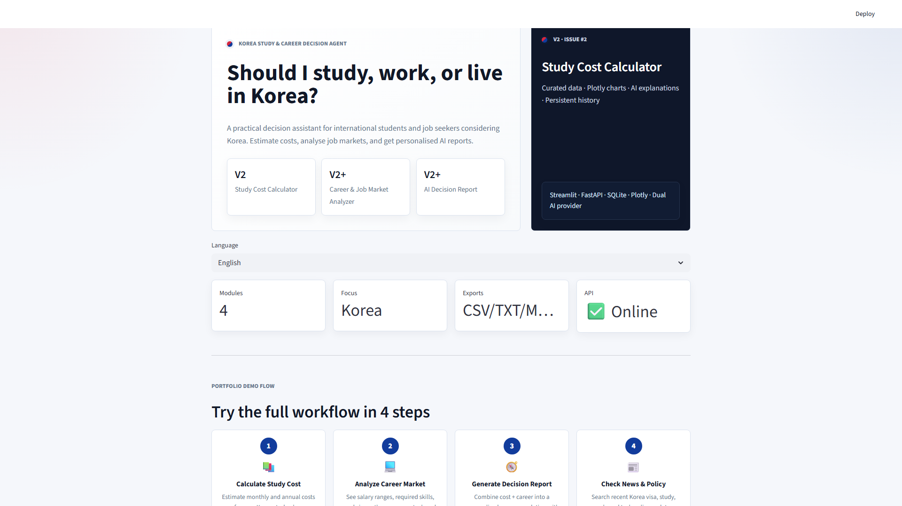
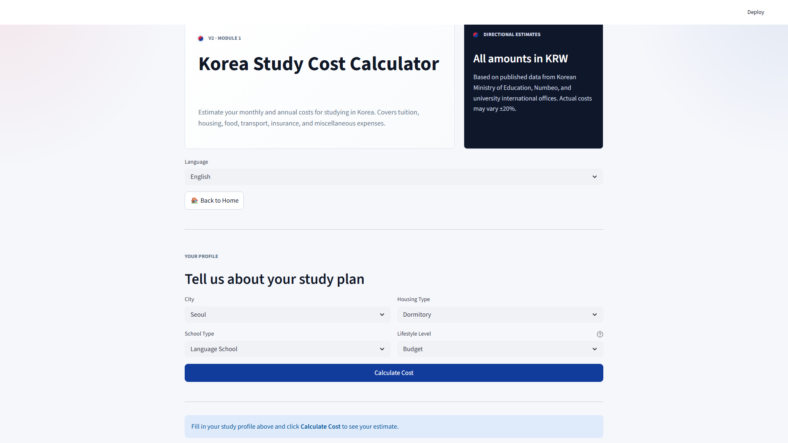
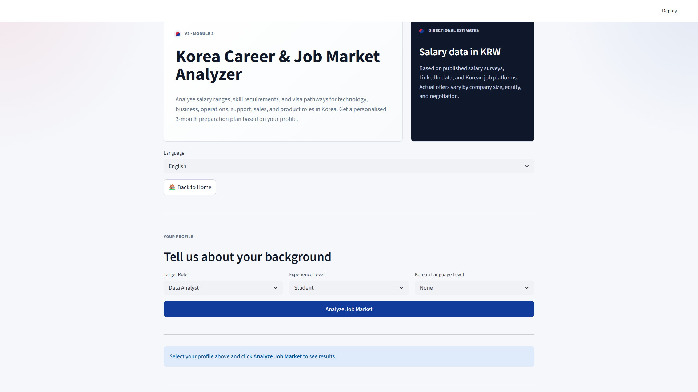
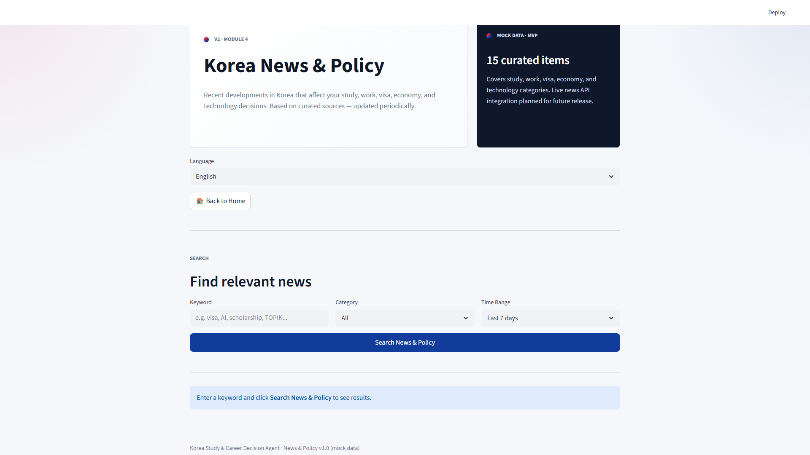
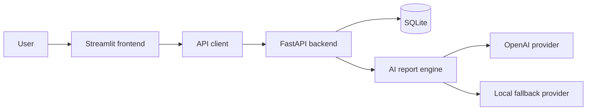

# Korea Study & Career Decision Agent

> *Should I study, work, or live in Korea?*

A practical decision assistant for international students and job seekers considering Korea. Estimate study costs, analyse job markets, catch up on visa/news updates, and receive personalised AI decision reports.

## Screenshots

### Home — 4-Step Demo Flow



### Study Cost Calculator



### Career & Job Market Analyzer



### AI Decision Report


### News & Policy



## Modules

### 📚 Study Cost Calculator *(V2 · New)*

Estimate monthly and annual costs for studying in Korea. Select your city, school type, housing, and lifestyle to get a detailed cost breakdown with interactive Plotly charts and AI-generated explanations.

| Input | Options |
|-------|---------|
| City | Seoul, Busan, Daejeon, Daegu, Other |
| School Type | Language School, Undergraduate, Graduate School |
| Housing | Dormitory, Shared Apartment, Studio Apartment |
| Lifestyle | Budget, Standard, Premium |

**Output:** Monthly cost, annual cost, breakdown pie chart, monthly vs annual bar chart, AI summary, CSV export, history persistence.

### 💻 Career & Job Market Analyzer *(V2 · New)*

Analyse salary ranges, skill requirements, and visa pathways for technology, business, operations, support, sales, and product roles in Korea. Get a personalised 3-month preparation plan based on your experience and Korean language level.

| Input | Options |
|-------|---------|
| Role | Data Analyst, Backend Developer, AI Product Manager, AI Engineer, Marketing Specialist, Business Analyst, Operations Specialist, Customer Support Specialist, International Sales, Product Manager |
| Experience | Student, 0-2 years, 3-5 years |
| Korean Level | None, TOPIK 3, TOPIK 4, TOPIK 5+ |

**Output:** Salary range bar chart, skills matrix, language gap analysis, competitiveness score, visa pathway, 3-month action plan, CSV export.

### 📰 News & Policy *(V2 · New)*

Search recent Korea-related news and policy developments across Study, Work, Visa, Economy, and Technology categories. Get AI-generated trend summaries and practical action suggestions based on curated mock news data.

| Input | Options |
|-------|---------|
| Keyword | Free text search |
| Category | Study, Work, Visa, Economy, Technology, All |
| Time Range | Last 7 days, Last 30 days, Last 90 days |

**Output:** Category distribution chart, relevance score chart, result cards with impact analysis, AI trend summary, action suggestions, TXT export.

### 🧭 AI Decision Report *(V2 · New)*

Combine study cost and job market analysis into a personalised decision report. Assess financial fit, career fit, language requirements, and visa pathways — with a 3-month action plan.

**Output:** Overall recommendation card, budget gap chart, risk profile bar chart, cost breakdown, salary info, 3-month action plan, TXT/Markdown/JSON export.

## Demo Flow

The home page guides you through 4 steps:

1. **📚 Calculate Study Cost** — Enter city, school, housing, and lifestyle → see pie chart, bar chart, and AI summary
2. **💻 Analyze Career Market** — Select role, experience, and Korean level → see salary range, skills matrix, and preparation plan
3. **🧭 Generate Decision Report** — Combine cost + career data → see recommendation card, risk chart, and 3-month action plan
4. **📰 Check News & Policy** — Search by keyword and category → see relevance-ranked results with charts and trend summary

## Data Provenance

### Sources

This project provides educational and informational guidance for users interested in studying, working, or living in South Korea.

Data used in this project is derived from publicly available sources, including:

* South Korean government agencies
* University websites
* Public visa information
* Job market reports
* News articles and industry publications

### Assumptions

* Cost estimates are directional estimates based on typical student lifestyles.
* Salary ranges are approximate market observations and may vary by company, role, experience, and language proficiency.
* Policy summaries may become outdated as regulations change.

### Update Cadence

Data should be reviewed and updated quarterly.

### Disclaimer

Users should verify all important decisions using official sources before making study, employment, or immigration decisions.

This project does not provide legal, immigration, financial, or professional advice.

## Internationalization

* English and Simplified Chinese UI support.
* Chinese mode translates user-facing labels, options, result cards, and chart labels where practical.
* Internal API and database values remain stable English identifiers for compatibility.
* Source URLs, filenames, API paths, code identifiers, and technical terms remain unchanged where appropriate.
* Detailed i18n design: [docs/KOREA_ANALYSIS_I18N.md](docs/KOREA_ANALYSIS_I18N.md)

## Architecture



Detailed architecture and request flows are documented in [docs/architecture.md](docs/architecture.md).

The original V2 implementation plan is kept as [KOREA_ANALYSIS_V2.md](KOREA_ANALYSIS_V2.md) for traceability; its core V2 modules are implemented in the current release.

## Tech Stack

| Layer | Technology |
|---|---|
| Frontend | Streamlit |
| Visualizations | Plotly |
| Backend | FastAPI |
| Validation | Pydantic |
| ORM | SQLAlchemy |
| Database | SQLite |
| HTTP client | Requests |
| AI provider | OpenAI-compatible SDK |
| Local AI fallback | Rule-based structured report engine |
| Tests | Pytest and FastAPI TestClient |

## Portfolio Highlights

- FastAPI REST API with modular routers (8 routers, 12+ endpoints)
- Streamlit multi-page product interface focused on 4 V2 modules
- Plotly charts: pie, bar, radar, horizontal bar, donut, grouped bar
- CSV, TXT, Markdown, and JSON export across all modules
- Structured decision report engine with 4-dimensional risk scoring
- Dual AI provider architecture (OpenAI + deterministic fallback)
- 15+ curated news items with relevance scoring and category filtering
- SQLite persistence with SQLAlchemy (7 tables, model-first design)
- 86 automated endpoint and business-rule tests

## Project Structure

```text
south_korea_perception_analysis/
|-- app.py
|-- api_client.py
|-- ui_style.py
|-- requirements.txt
|-- study_cost_config.py              # compatibility shim
|-- job_market_config.py              # compatibility shim
|-- decision_report_config.py         # compatibility shim
|-- news_policy_config.py             # compatibility shim
|-- pages/
|   |-- 1_Study_Cost.py
|   |-- 2_Job_Market.py
|   |-- 3_Decision_Report.py
|   `-- 4_News_Policy.py
|-- legacy/
|   `-- v1_archive/
|       |-- 1_Comparison_Lab.py
|       |-- 2_Perception_Survey.py
|       `-- 3_Community_Insights.py
|-- backend/
|   |-- requirements.txt
|   `-- app/
|       |-- main.py
|       |-- config.py
|       |-- database.py
|       |-- models.py
|       |-- schemas.py
|       |-- ai/
|       |   |-- report_engine.py
|       |   |-- openai_provider.py
|       |   `-- local_provider.py
|       |-- services/
|       |   |-- study_cost_config.py
|       |   |-- job_market_config.py
|       |   |-- decision_report_config.py
|       |   `-- news_policy_config.py
|       `-- routers/
|           |-- health.py
|           |-- countries.py
|           |-- surveys.py
|           `-- ai.py
|-- tests/
|   |-- test_surveys.py
|   |-- test_ai_report.py
|   `-- test_community_summary.py
|-- docs/
|   |-- architecture.md
|   `-- screenshots/
`-- CHANGELOG.md
```

## Local Setup

### 1. Clone and enter the project

```bash
git clone <repository-url>
cd south_korea_perception_analysis
```

### 2. Install backend dependencies

```bash
cd backend
pip install -r requirements.txt
```

### 3. Start the API

```bash
uvicorn app.main:app --reload
```

The API is available at `http://localhost:8000` and the interactive documentation at `http://localhost:8000/docs`.

### 4. Start the frontend

In a second terminal:

```bash
cd south_korea_perception_analysis
pip install -r requirements.txt
streamlit run app.py
```

The frontend is available at `http://localhost:8501`.

### Optional OpenAI configuration

The product works without a paid API.

```powershell
$env:OPENAI_API_KEY="your-key"
```

When the key is missing or the provider fails, Korea Analysis automatically uses the local structured-report provider.

## API Overview

| Method | Endpoint | Purpose |
|---|---|---|
| `GET` | `/api/v1/health` | Service health |
| `GET` | `/api/v1/countries` | Country benchmark scores |
| `GET` | `/api/v1/countries/{country}` | Scores for one country |
| `POST` | `/api/v1/perception-surveys` | Submit a survey |
| `GET` | `/api/v1/perception-surveys` | Latest survey submissions |
| `GET` | `/api/v1/perception-surveys/stats` | Survey statistics and Korea baseline |
| `GET` | `/api/v1/perception-surveys/community-summary` | Community analytics |
| `POST` | `/api/v1/study-cost/calculate` | Calculate study costs with breakdown |
| `GET` | `/api/v1/study-cost/history` | Study cost calculation history |
| `POST` | `/api/v1/job-market/analyze` | Analyse career and job market data for a role |
| `GET` | `/api/v1/job-market/history` | Job market analysis history |
| `POST` | `/api/v1/decision-report/generate` | Generate personalised decision report |
| `GET` | `/api/v1/decision-report/history` | Decision report history |
| `POST` | `/api/v1/news-policy/search` | Search news and policy items |
| `GET` | `/api/v1/news-policy/history` | News search history |
| `POST` | `/api/v1/ai/perception-report` | Structured perception report |

## Testing

```bash
pytest
```

The test suite covers survey validation, survey endpoints, community aggregation, profile classification, local AI fallback, and AI report responses.

## Roadmap

- Improve responsive mobile layouts
- Add exportable PDF perception reports
- Add configurable benchmark datasets and data provenance
- Add deployment configuration and automated CI checks
- Add accessibility and internationalization review

## License

This project is licensed under the MIT License.
See the [LICENSE](LICENSE) file for details.
