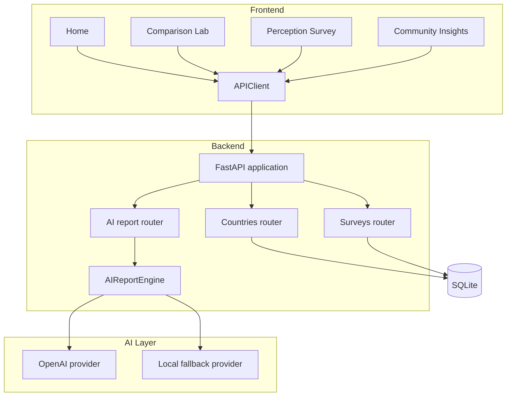
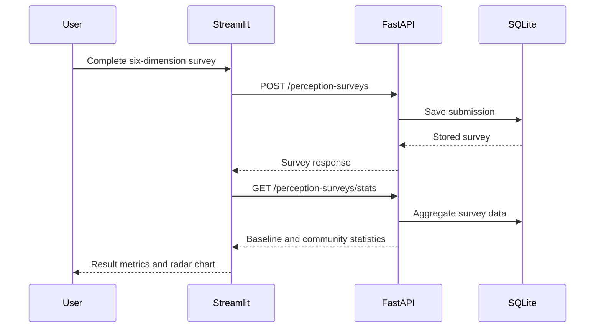
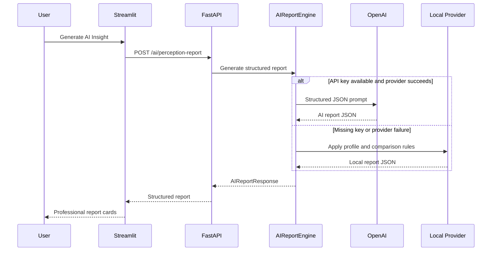

# Korea Analysis Architecture

Korea Analysis uses a small, modular architecture designed for local development, portfolio demonstration, and future deployment.

## System Overview

## Frontend

The frontend is a Streamlit multi-page application:

- `app.py`: onboarding, product positioning, and primary navigation
- `pages/1_Comparison_Lab.py`: regional benchmark exploration
- `pages/2_Perception_Survey.py`: survey, radar comparison, and AI report
- `pages/3_Community_Insights.py`: aggregated community analytics
- `api_client.py`: shared HTTP boundary between Streamlit and FastAPI
- `ui_style.py`: shared product styling

Plotly provides radar, horizontal bar, and profile distribution charts.

## Backend

FastAPI exposes versioned REST endpoints under `/api/v1`.

- `countries.py`: benchmark score retrieval and management
- `surveys.py`: survey submission, statistics, and community summaries
- `ai.py`: structured perception report generation
- `health.py`: service health

Pydantic validates request and response structures. SQLAlchemy manages SQLite persistence.

## Database

SQLite stores:

- Country benchmark scores
- Perception survey submissions

AI reports are generated on demand and are not persisted.

## AI Layer

`AIReportEngine` provides a stable provider boundary.

1. If `OPENAI_API_KEY` exists, it attempts the OpenAI provider using `gpt-4o-mini`.
2. If the key is missing or the provider fails, it returns a deterministic local report.
3. Both providers return the same `AIReportResponse` structure.

This keeps local development free and makes the report endpoint resilient.

## Survey Flow

## AI Report Flow

## Design Constraints

- No authentication or user accounts
- No paid API required for local use
- No report persistence
- Repeated survey submissions are allowed
- Community comments are displayed without account identity

