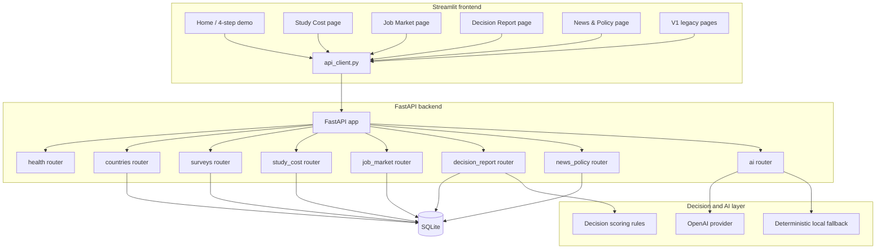
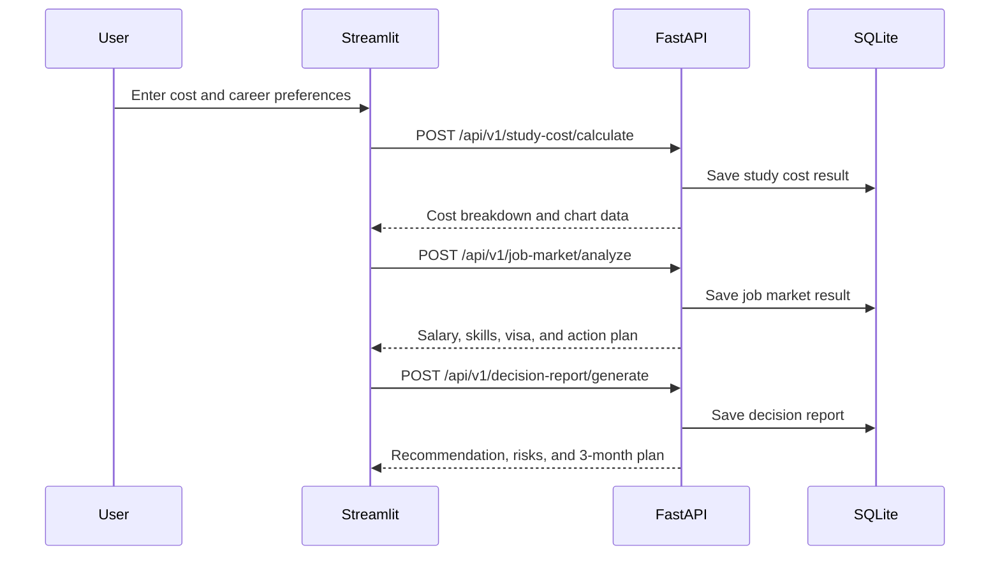
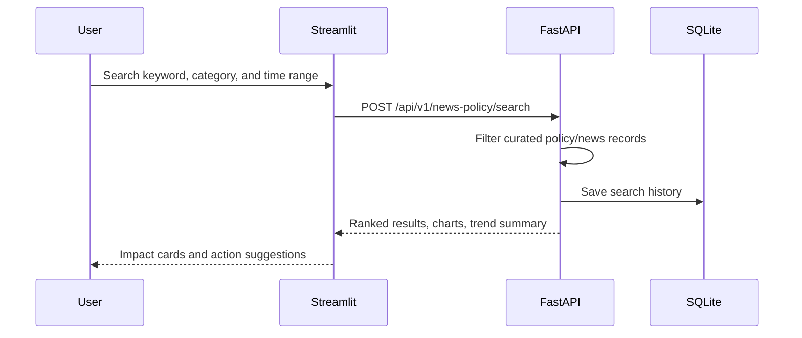

# Korea Analysis Architecture

Korea Analysis is a Streamlit and FastAPI decision assistant for people considering study or work in South Korea. The current V2 architecture keeps the app local-demo friendly while separating UI, API, persistence, and AI report generation.

## System Overview

## Frontend

The frontend is a Streamlit multi-page product interface:

- `app.py`: landing page, positioning, and 4-step demo flow.
- `pages/1_Study_Cost.py`: V2 study cost calculator.
- `pages/2_Job_Market.py`: V2 IT job market analyzer.
- `pages/3_Decision_Report.py`: V2 decision report generator.
- `pages/4_News_Policy.py`: V2 news and policy search.
- `pages/1_Comparison_Lab.py`, `pages/2_Perception_Survey.py`, and `pages/3_Community_Insights.py`: V1 supporting modules.
- `api_client.py`: shared HTTP boundary between Streamlit and FastAPI.
- `ui_style.py`: shared product styling.

Plotly is used for cost breakdowns, salary ranges, risk charts, radar charts, and category summaries.

## Backend

FastAPI exposes versioned REST endpoints under `/api/v1`.

- `health.py`: service health.
- `countries.py`: benchmark country scores for the comparison lab.
- `surveys.py`: perception survey submission, statistics, and community summaries.
- `study_cost.py`: cost calculation, breakdown, and history.
- `job_market.py`: role analysis, salary range, language gap, skill requirements, and history.
- `decision_report.py`: combined cost and career decision report generation and history.
- `news_policy.py`: curated news and policy search, relevance scoring, and history.
- `ai.py`: structured AI perception report generation for the legacy survey flow.

Pydantic validates request and response structures. SQLAlchemy manages SQLite persistence.

## Database

SQLite stores:

- Country benchmark scores.
- Perception survey submissions.
- Study cost calculation history.
- Job market analysis history.
- Decision report history.
- News and policy search history.

The database is intended for local demonstration and sample data. It is not a production analytics store.

## Decision Module Flow

## News & Policy Flow

## AI Layer

The AI layer is designed to work with or without paid API access.

1. If `OPENAI_API_KEY` exists, the OpenAI-compatible provider is attempted for richer narrative output.
2. If the key is missing or the provider fails, deterministic local rules return the same response structure.
3. Decision report and perception report flows keep generated output structured so the UI can render stable cards, charts, and exports.

## Design Constraints

- No authentication or payment modules.
- No live web scraping in the portfolio demo.
- No legal, immigration, financial, or professional advice.
- Curated data should be treated as directional and periodically reviewed.
- Users should verify high-stakes decisions against official sources.
